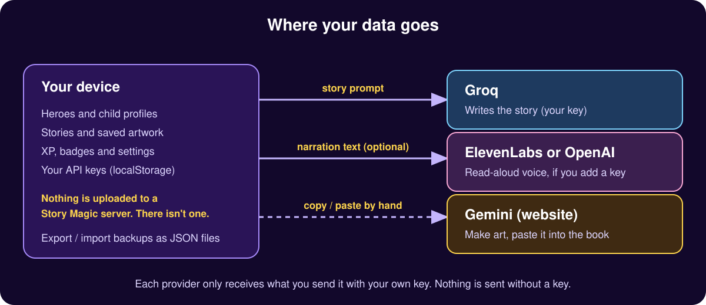

<p align="center"></p>

# Story Magic

Personalised AI storybooks for kids. Build up to four heroes, pick a world, a quest and a story style, and Story Magic writes the story with read-aloud narration and illustrations. It is a single-file PWA with a landing page, built by [LAZLAB Creations](mailto:lazlab.io@gmail.com).

## Live

- Landing page: https://johnlaz.github.io/storymagic/
- App: https://johnlaz.github.io/storymagic/app/ (installs to the home screen on iOS and Android)

## Repo layout

```
/index.html          landing page
/favicon.ico         landing favicon
/privacy.html        privacy page (linked from the landing footer)
/sw.js               retires the old root-scope worker from pre-/app installs
/README.md           this file
/docs/               README SVGs (banner.svg, data-flow.svg)
/app/index.html      the PWA (single file)
/app/manifest.json   web app manifest (scope and start_url: /app/)
/app/sw.js           service worker (network-first HTML, cache-first assets)
/app/icon-192.png    app icon
/app/icon-512.png    app icon
/app/shot-*.png      app screenshots (manifest and landing page; shot-desktop.png is a composite of real captures)
```

## AI and model setup

Everything is optional and uses your own keys, set in the app's **Parent Area**. Keys are stored only in your browser (localStorage).

| Provider | Used for | Notes |
|---|---|---|
| Groq | Story writing | Default model `llama-3.3-70b-versatile`. Saving a key loads Groq's current chat model list into the picker; **Refresh** reloads it. Your saved model is never swapped automatically. If it disappears from Groq's list it stays selected and is flagged. |
| ElevenLabs / OpenAI | Read-aloud voice | Optional. Without a key the device voice is used. |
| Gemini | Artwork | No API key. The app copies your story prompt and opens gemini.google.com; you save the image back into the book. |

Without a Groq key the app uses its built-in sample stories.

## Data and privacy

<p align="center"></p>

Heroes, stories, artwork, progress and keys live in your browser on your device. There is no Story Magic server or account. Text is sent only to the providers you turn on with your own key (see the diagram). Use **Export** in the Parent Area to back up or move your data. Full details: [privacy.html](privacy.html).

## Deploy and update

1. Settings > Pages > Deploy from a branch > `main` / `(root)`.
2. Edit files, commit, push. Pages publishes in about a minute.
3. When you change the app, bump **both** `APP_VERSION` in `app/index.html` and `VERSION` in `app/sw.js` to the same number. That renames the cache, so installed copies pick up the new files. Open apps show an "Update ready" prompt; others update on next launch.

The version shown in the app header comes from `APP_VERSION`.

## Changelog

### v3.2
- Print ordering hidden: it only simulated sending an email. Landing copy no longer promises printed books; the card now describes PDF export.
- Landing: "Open App" and the bottom button no longer wrap on small phones; added a Privacy page and footer link.
- First run starts with no pre-made heroes; the library counts only your own stories (samples are labelled as samples); "2 heros" is now "2 heroes".
- Storage-full guard: a clear message instead of silently failing to save.
- Manifest: added a wide screenshot. Added a root `sw.js` that removes the old root-scope worker for installs made before the `/app` move (those installs should be reinstalled from `/app/`).

### v3.1
- Fixed icons: manifest and app icons now live in `/app` (they were pointing at a folder that didn't exist).
- Service worker rewritten: network-first HTML so updates arrive, cache-first assets, fonts cached for offline, API hosts matched exactly, update prompt, cache tied to the app version.
- Groq model picker with fetch-on-key-save and Refresh; existing default and saved choice preserved.
- Manifest screenshots added; icons declared `any` only.
- Landing page shrunk from 13.9 MB to about 30 KB plus lazy-loaded screenshots; new vector logo mark; one hero screenshot; mobile menu; corrected privacy and Gemini wording; footer updated.
- Reader page restyled as paper; zoom enabled; keyboard access, focus outlines, reduced-motion support.
- Repo flattened (extra icon sizes, duplicate favicon and `.keep` files removed).

### v3.0
- Previous release.
